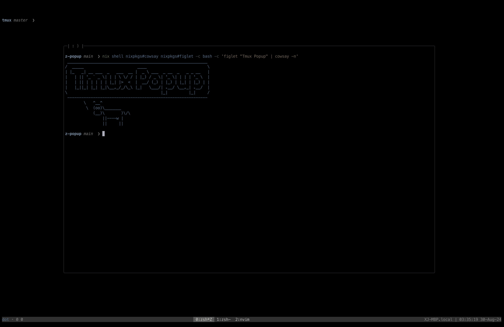

# Z-Popup

Wrap Tmux popup.

## Key Bindings

- `@z-popup-bind` : popup (default: `` ` ``)
- `@z-popup-bind-isolate` : different popup in each session (default: `@`)
- `@z-popup-bind-break` : break pane (default: `!`)
- `@z-popup-bind-detached` : break pane and detach (undefined)

## Options

- `@z-popup-title-type` : popup title type (`path`, `no`, `off`) (default: `off`)
- `@z-popup-title` : popup title (default: `| : ) |`)
- `@z-popup-session-name` : popup session name (default: `Z-Popup`)
- `@z-popup-text-color` : popup text color (default: `blue`)
- `@z-popup-border-color` : popup border color (default: `black`)
- `@z-popup-border-line` : popup border line (default: `rounded`)
- `@z-popup-width` : popup width (default: `75%`)
- `@z-popup-height` : popup height (default: `75%`)
- `@z-popup-status` : popup status (default: `on`)
- `@z-popup-status-position` : popup status position (default: `bottom`)
